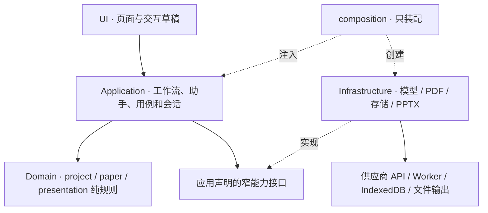
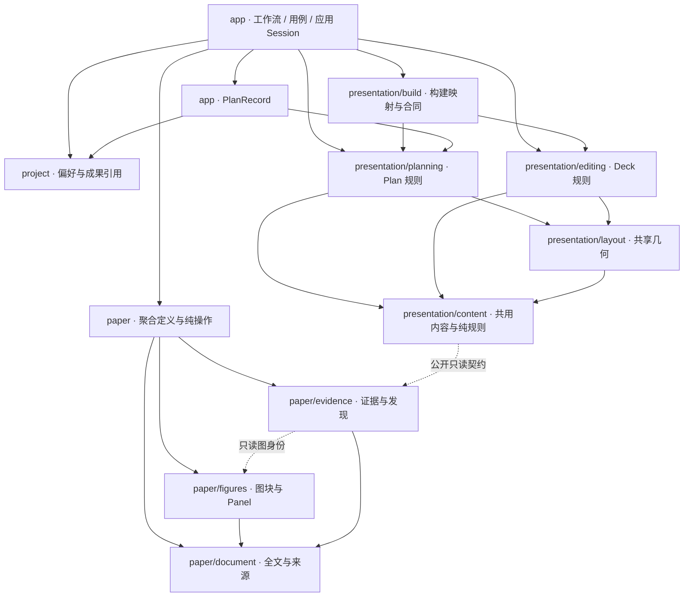

# 技术边界、领域术语与模块分层

> v0.5 规格；实际交付与验收状态见 [执行目录](../execution/README.md)。

## 1. 技术边界与术语

应用是 GitHub Pages 上的静态 PWA，项目处理、存储、裁图与 PPTX 导出在浏览器执行，仅模型请求访问用户选择的供应商。沿用 React + TypeScript + Vite + Tailwind CSS、Zod、PDF.js、PptxGenJS、IndexedDB、Pi AI 与已接入的 pi-agent-core；安装版本以 lockfile 为准，不因设计更新更换栈。

### 领域术语

术语集中在本节，不另建重复的 CONTEXT.md 或领域定义文档。

| 术语 | 唯一含义 |
|---|---|
| Project | 一篇论文的固定文件集合（主论文及可选补充 PDF）及其工作底稿、汇报与编辑成果的本地工作单元 |
| PaperDocument / 论文文件 | 同一 Paper 中的一份固定主论文或补充 PDF，持有稳定文件身份与资源映射；文件内页码不跨文件拼接 |
| Paper / 论文底稿 | 文章本身的完整解析、图源、观察与发现；独立于汇报篇幅和 PPT 布局 |
| TextBlock | PDF 中可定位的正文、方法、图注、表格等文本块；完整文本的唯一内容载体 |
| SourceReference | 某份论文 PDF 中可定位的文字片段或图源；documentId、页码与原始 bbox 的持有者 |
| Figure / FigureRegion / Panel | Figure 为论文整图身份；FigureRegion 为其中一个可裁切的单页图块；Panel 归属图块，保留必要科学标注，不要求互斥分区 |
| Claim / 研究发现 | 基于论文证据的发现或结论，保留科学强度；不与一张 PPT 或单个 Panel 一一对应 |
| Evidence / 证据 | 实验、观察或分析结果及原文/图源依据；通过来源关联多个片段或 Panel |
| Figure review / 图源核对 | 用户查看并修正自动切分、确认当前切分版本；不表示逐条科学事实已人工验证 |
| SpeechParagraph / 讲述段落 | 大纲中的稳定讲述单元，拥有章节、目的和有序片段；分页不改变段落 |
| SpeechSegment / 讲述片段 | 唯一保存讲稿正文与引用的可分配单元，归属段落；一段可跨页，一页可含多段片段 |
| DeckPlan | 可编辑的大纲、演讲稿与下游页面规划的统一工作产物；用户分步推进，ready 仅表示程序校验就绪 |
| Section | 单层叙事章节；kind 为内容职责，track 为主线或补充，与布局独立 |
| Deck / Slide | 已保存的演示文稿与单页；包含其最终结构、讲稿和绑定的论文依据 |
| 本页图像实例 / 图组 | 实例是某页对图块或 Panel 的一次使用；图组是本页这些实例的排列，不创建新的论文 Figure 身份 |
| RevisionProposal | AI 对已有成果的内存修改提案，应用后才提交；刷新/关闭项目后丢弃 |
| 完整新稿候选 | 已完整生成并保存、尚未替换 Current 的独立 Deck；每项目最多一份，刷新可查看，过期只读 |
| ResearchStrategy | 可配置的研究讲述建议，不是研究类型枚举或独立生成流程 |
| Revision | 一次逻辑编辑后的版本；批量修改原子提交，对应一次 Undo |
| AnalysisUnitRecord | 已校验并落盘的页/图块/证据整理单元及输入依据，供刷新后手动续跑复用 |
| Checkpoint | 已完整持久化的阶段产物，独立于单元进度、用户授权或后台任务 |
| Current / Working / Previous | 当前稿、未替换当前稿的工作产物、唯一上一版；不存在版本树 |

### 四层结构与依赖方向

v0.5 按 UI、Application、Domain、Infrastructure 四层组织。下面描述目标归属，当前 v0.4 的文件位置见迁移表；M13 不搬迁代码。

| 层 | 唯一职责 | 允许依赖 | 禁止承担 |
|---|---|---|---|
| UI：src/ui | 工作台、输入草稿、选择、视图模型订阅 | 应用公开用例/查询、领域公开只读类型、纯展示几何 | 模型调用、阶段分支、领域修改规则、数据库事务 |
| Application：src/app | 用例、固定 workflow、任务生命周期、编辑登记、会话保存编排、候选与跨对象提交协调 | 领域公开入口、自身定义的外部能力接口 | React 生命周期、图切分算法、第二份领域规则 |
| Domain：src/modules | 数据定义、纯校验、内容修改、依赖影响与纯撤销规则 | 本模块、允许的领域公开入口、少量纯 shared | 异步保存回调、React、DOM、Pi、PDF.js、PptxGenJS、IndexedDB |
| Infrastructure：src/infrastructure | 模型/PDF/数据库/导出适配器 | 领域类型/纯规则、应用接口的 type-only 引用、第三方库 | 决定是否需要核对、下一阶段、主线取舍或 AI 权限 |

应用层对外部能力只声明真实所需的窄接口，参数使用具名对象；模型、PDF、存储及导出实现在 composition 中装配。普通用例不直接 import 具体适配器；composition 是唯一装配例外，只把实例传给用例，不持有业务流程。接口可与实际用例同文件，不强制独立 ports 目录、DI 容器或一函数一接口。领域纯计算直接调用，不套 repository/service，不建设通用事件总线、CQRS、注册中心或插件平台。

UI 中的 controller hook 仅绑定用例、订阅任务/内容变化并管理交互草稿；启动后流程可以脱离 React 执行。项目级应用控制器持有生成任务、内容会话、Undo 与局部提案，普通组件卸载或项目内步骤切换不释放它们；不能让重新 render 创建新 workflow、会话或提交。离开项目须经过保存/放弃检查，并清空局部提案和 Undo；返回项目列表时已启动的完整生成继续，完成后释放无人查看的会话资源。显式暂停、删除项目或冲突编辑使相应任务失效；浏览器关闭/刷新不恢复运行请求。固定流程使用普通显式函数，交互助手沿用 pi-agent-core，通过基础设施适配器创建 Agent 并转换事件，app/assistant 定义目标、工具回调与提案编排；两者共享用例权限和提交入口，不共享一套自由 Agent loop。

图源页选择属于 paper：它决定页面是否进入图源处理，不代表正文提取范围、Figure 身份或汇报取舍；字段见[数据模型](数据模型.md)。本地计算池和模型请求池分离，职责、限额与取消见[并发与任务调度](并发与任务调度.md)。

### 架构图

实线表示调用，虚线表示实现接口或装配注入；适配器接在应用声明的能力接口之后，不是领域必须穿过的下一层。这里只描述目标架构，不代表代码已经迁移。



app 内的依赖同样单向：UI 显式启动 workflow 或助手；workflow/assistant 调用内容用例，内容用例调用对应应用 Session 与领域规则，不反向启动 workflow/Agent。分步自动推进由 workflow 决定；Session 不生成下一阶段，不负责模型重试。任务身份、取消与编辑登记归应用，底层请求排队/并发/退避归适配器。普通查询只组合已保存成果与应用内存事实，不启动写入或修复。

### 三个领域模块与数据所有权

| 模块 | 拥有的数据与规则 | 允许的领域依赖 |
|---|---|---|
| project | 项目身份、偏好、工作底稿/Current/Previous/完整候选引用及其局部合法性 | shared；不拥有论文分析或文稿内容规则 |
| paper | TextBlock、来源、Figure/Panel、切分核对、Evidence、Claim 与论文内部关联 | shared；不依赖 project、presentation 或应用 |
| presentation | Plan、Deck、章节、讲稿、页面、覆盖取舍、内容编辑与共享布局 | paper 的公开只读证据契约、shared；不反向修改 Paper |

project 中“指针存在且属于同项目”的跨对象检查由应用用例组合领域规则，在事务内再次检查；project 不通过 import repository 操作其他领域。paper 保存 projectId 只是归属标识，不产生代码反向依赖。

Plan 与 Deck 属于同一汇报领域，planning/editing 是内部职责，不是两个独立事实体系。presentation/content.ts 维护共同的章节、讲稿、引用、图像实例/分区定义及确有相同语义的移动/删除/分配纯规则；planning 与 editing 各自维护 Plan/Deck 专属结构和校验，均引用 content，不互相导入内部实现。layout 只读 content 中的必要定义和普通布局输入，不导入 planning/editing；输入映射由各自调用方完成，不让布局函数识别 Plan|Deck 生命周期。presentation/build.ts 组合 Plan → Deck 的纯映射与构建合同，可以依赖 planning/editing，二者不反向依赖 build；跨两种产物的规则不塞进任意一侧。共同文件只在实际职责过多时拆分，不创建平行 Schema 或万能内容模型。生成后的大纲视图直接编辑 Current Deck；消费的 Plan 不再可写。

OutlineSession 与 DeckSession 是 app/use-cases 中两个明确的内容保存编排入口，分别持有对应对象的已保存状态和内存 Undo 栈；Plan 的 draft/ready 与 Deck 的 Current/Previous 生命周期仍独立，不合成万能 Session。领域仅产生修改/撤销候选、校验和影响结果，不接收保存回调。应用 Session 经存储接口提交，成功后才接受已保存版本并推进 Undo；失败不改变会话基准或撤销游标。事务命名、跨对象协调归应用，IndexedDB 执行归基础设施，完整顺序只在[编辑与 Agent](编辑与Agent.md)维护。

图源内容由 paper 的单一纯操作入口维护，再由应用图源用例提交。仅在页面授权自然语言修改时，AI 的手工等价操作复用相同 mutation/validator；论文分析与图源核对的 Agent 只读，图源重识别由独立按钮工作流触发。助手共用请求/取消/提案展示，但根据实际 Plan 或 Deck 接入其应用会话，不依赖空 Deck。

### 内部模块与记录所有者

| 归属 | 唯一内容与边界 |
|---|---|
| project | Project、Preferences、GenerationBase、DeckCandidateReference 及其局部结构规则。基准只含引用身份、版本和项目偏好，不嵌入 Paper/Deck 正文；实际基准捕获与跨对象比较由应用完成 |
| paper/document | PaperDocument、TextBlock、SourceReference 与来源定位纯规则；不导入 figures/evidence，不按来源 kind 反向访问图或发现 |
| paper/figures | Figure/Region/Panel、图注关联、切分与核对纯规则；只依赖 document 的公开契约，不导入 evidence |
| paper/evidence | Claim、Evidence、文章故事点及其来源规则；依赖 document 的来源契约，需要图身份关系时只读 figures 的公开类型；不反向修改图集合 |
| paper 的 model.ts / mutations.ts | 组合 Paper 定义与论文内部完整修改；可以调用 document/figures/evidence，子模块不反向引用聚合入口。删除 Panel、图块改归属等同批维护来源、核对及证据引用，返回完整候选与影响 ID；跨到 Plan/Deck 的影响由应用组合 |
| presentation/content.ts | Plan/Deck 共用的内容定义与纯规则；只读 paper 的证据契约，不依赖 planning/editing/layout 或项目记录 |
| app/workflows 的记录定义 | PlanRecord 组合 DeckPlan、项目偏好和 GenerationBase，归应用而非任一领域；放在工作流就近的独立记录文件，供用例和存储类型引用，不从 workflow 可执行入口取类型 |
| app/use-cases 的模型配置用例 | 全局 ModelSettings 记录契约、归一化/校验入口、保存/清除和能力检查协调；配置纯函数与调用编排分开，接口允许适配器 type-only 引用。不加入 Project/Paper，也不增加第四个核心领域；适配器只映射已归一化配置并执行请求，UI 不另写规则 |

### 模块依赖图

箭头表示允许的代码依赖，包含 type-only；虚线是明确的只读契约。图省略各模块对纯 shared 的依赖。paper 的聚合操作与公开只读契约分开导出，presentation 不深层导入论文私有文件。



领域不得导入 PlanRecord、应用 Session 或全局模型配置。paper 的公开只读证据契约可同时暴露必要的来源与图身份类型，不暴露聚合 mutation；presentation 不负责更新这些对象。基础设施对 PlanRecord/配置/能力接口只作 type-only 引用，不调用应用用例；运行时校验由应用传入已装配的纯函数复用，不从基础设施反向 import 应用编排。共享业务内容保持其领域归属，不能为绕过依赖检查移入 shared。

### 目标目录与当前实现归位

以下是职责图，只在实际工作需要时创建目录/文件，子组不强制生成一整套 service/repository/controller。

```text
src/
├─ app/
│  ├─ workflows/          # 全文准备、分步生成、阶段恢复；就近定义 PlanRecord
│  ├─ use-cases/          # 应用 Session、编辑登记、配置、图源/候选提交、恢复、导出
│  ├─ assistant/          # 助手用例、读工具接线、提案与实际范围
│  └─ composition/        # 组装外部能力；无业务分支
├─ modules/
│  ├─ project/            # 项目身份、偏好、指针规则
│  ├─ paper/
│  │  ├─ model.ts         # 组合完整 Paper；不承担 I/O
│  │  ├─ mutations.ts     # 组合论文内部修改及影响；不跨域写入
│  │  ├─ document/        # 全文块与来源定位的领域定义/纯处理
│  │  ├─ figures/         # 框、标签、切分修正、核对与纯像素分析
│  │  └─ evidence/        # 观察、发现及来源关联
│  └─ presentation/
│     ├─ content.ts       # 共用章节/讲稿/引用/分区定义与必要纯规则
│     ├─ build.ts         # 组合 Plan → Deck 的纯映射与合同
│     ├─ planning/        # Plan 专属定义、修改与校验
│     ├─ editing/         # Deck 专属定义、修改、差异与纯撤销规则
│     └─ layout/          # 预览与导出共享几何
├─ infrastructure/
│  ├─ llm/                # Pi 请求、Agent 实例/事件适配、Prompt 加载
│  ├─ pdf/                # PDF.js 与渲染资源
│  ├─ persistence/        # IndexedDB、repository 映射及原子提交实现
│  └─ pptx/               # PptxGenJS 输出
├─ ui/
│  ├─ workspace/          # 固定外壳、主操作、任务视图
│  ├─ paper/              # 原文、发现、切分核对
│  ├─ presentation/       # 大纲/讲稿、页面与检查
│  └─ components/         # 真正复用的控件与展示部件
└─ shared/                # 纯基础类型/几何/错误；无业务流程
prompts/                  # 沿用配置入口
```

| 历史 v0.4 迁移来源 | 目标归属与拆分理由 |
|---|---|
| src/ui/project/useProjectController.ts | UI 草稿/选择留 ui；阶段 switch、取消/继续、跨内容提交进入 app；不把整个 hook 原样挪成巨型 service |
| src/modules/generation | 编排与计划/页面模型任务进入 app/workflows；构建纯映射/合同进入 presentation/build；候选持久化进入 infrastructure/persistence |
| src/modules/outline、src/modules/deck | 纯内容归 presentation/content/planning/editing/layout；OutlineSession/DeckSession 保存编排归 app/use-cases，复用有效规则和历史语义，不保留域内保存回调 |
| src/modules/paper/analysis.ts、parsePaper.ts、sources.ts | 纯映射/验证归 paper；调用顺序与模型上下文组织归 app；PDF/Canvas 资源及模型调用归 infrastructure |
| 各领域 repository、shared/persistence | 具体 IndexedDB 实现归 infrastructure/persistence；应用命名并协调事务，领域不 import DB |
| src/modules/assistant | 目标/工具/提案编排归 app/assistant；领域 mutation 与校验留所属模块，Pi Agent 实例、事件和通信适配归 infrastructure/llm |
| shared/llm、shared/pdf、deck/export.ts | 分别归 infrastructure 的 llm/pdf/pptx；导出前检查与快照捕获归应用，共享布局留领域 |
| src/ui、outline/ui 与 app/presentation | UI 归 ui 对应视图；纯用例归 app/use-cases，不因名字包含 presentation 就混入领域或 UI |

跨领域通过明确公开入口，内部私有文件不可被其他领域深层引用。纯类型与运行入口按需分开，禁止领域公开入口顺带导出 UI/基础设施而把第三方库带入纯测试。shared 不收容 Speech/Claim/Plan，也不成为全项目聚合导出。工程入口沿用 src/main.tsx，Hash/PWA 启动接线保留在应用装配入口，不因此增加服务端或新框架。

迁移按执行计划逐阶段完成，迁移中的旧路径仅允许薄重导出且不得承载另一套逻辑，相关引用迁完即移除。M19 已移除上述退休流程、旧提交入口及无调用的重导出；历史纯 Schema、叙事校验与 Build 合同保留在 presentation/legacy，不含模型或存储流程。当前应用会话位于 app/presentation，生成位于 app/workflows，Prompt 文件加载和具体适配器位于 infrastructure；应用向适配器注入计划/配置纯校验。具体检查及尚未通过的整体 Gate 见 [M19 工作记录](../spec/M19.md)，不以目录归位代替三篇内容和发布验收。

### 工作台实现边界

[UI 规格](../ui/README.md)定义桌面工作台重设计。固定外壳统一分配窗口高度和滚动所有者；各视图只填导航、主画布、Inspector 与操作槽位，不复制任务栏、保存状态或 AI controller。视图切换不重新创建项目会话；选择上下文显式包含对象类型/ID/内容版本，旧稿读其绑定 Paper，新底稿读工作 Paper，不能共用一个含糊的 currentPaper。

外壳使用可用窗口高度（如 h-dvh）、overflow-hidden，子区 min-h-0/min-w-0；PDF/画布根据剩余空间缩放，各滚动区域独立。主题与布局采用 Tailwind CSS 4 的完整工具类，公共颜色/字体在 src/style.css 的 @theme；style.css 仅保留 Tailwind 导入、主题与必要全局基础规则，复用统一控件样式；不新增组件 CSS 或成片 @apply。运行时坐标/尺寸用共享几何计算后通过内联 style/CSS 变量传入。纯像素分析接收宽高和像素数组，Canvas ImageData 获取与释放在适配器，不将 DOM 类型带入领域。

UI 的指针预览不逐像素提交；完整一次拖框、一次文本编辑结束才调用一次内容用例，输入法组合期间不提交。第一次实际改动前先向应用登记对象、基准和未保存状态；草稿文字/临时框仍留 UI，应用不读取 React 状态。保存成功或明确放弃后解除该次登记，失败继续保护输入；细则见[接口契约](接口契约.md)。底部 AI 输入与 Inspector 共用一个 assistant controller；全局 Undo 根据当前编辑域调用对应应用会话，标签显示实际对象，不能同时撤销 Plan 和 Deck。保存失败保留草稿/焦点，切换前保存或明确放弃，不后台覆盖。

### 可测试性与实现边界

| 边界 | 独立测试方式 | 不可替代的检查 |
|---|---|---|
| 领域 | 普通对象、固定像素数组、固定 ID/时间；测几何、引用、讲稿分配、影响计算、Undo | 不声称纯几何证明科学正确 |
| 应用流程 | 注入模型/PDF/存储的窄替身；控制延迟、取消、失败，检查阶段顺序与提交调用 | 替身不能证明 IndexedDB 原子性或浏览器 CORS |
| 基础设施 | 浏览器验证真实 IndexedDB 回滚、PDF 坐标/资源、PPTX 页与备注 | 不把应用流程的每个分支都复制成浏览器 E2E |
| UI | 同一主链实操框选、选择联动、输入法、滚动、键盘、分栏调节 | DOM 存在或构建成功不等于可用 |
| 科学内容 | 既有三篇论文的原始切分/模型初稿与人工核对 | 固定响应不证明发现提取、切分或讲稿质量 |

外部依赖接口围绕真实测试替换点定义，不新建通用 mock 平台、存储框架或运行时插件系统。领域规则可以无浏览器运行，生成工作流可以无 React/真实模型运行；事务检查仍覆盖真实存储。依赖方向在实际迁移时纳入现有 check 的轻量静态检查，禁止运行和 type-only 反向依赖，不引入另一套 lint 框架。

沿用现有 Biome、Vitest 与脚本；npm run check 当前不包含 check:browser/check:pwa，不能将其通过写成全部集成验收通过。必要检查范围由执行计划唯一规定。一行一个主要动作，5–6 个以上参数改具名对象；Query 无副作用，Command 命名体现写入，关键不变量写短 JSDoc，不设机械 LOC/覆盖率目标。

HTML 原型只作为设计资产，内嵌脚本、localStorage 和示意 SVG 不作为应用模块的实现基线。应用侧仍遵循本节分层、统一会话与基础设施适配规则；原型自身不接入生产构建或 PWA 缓存。
